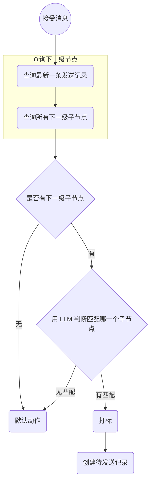

# 目的
sop匹配并回复

# 使用步骤
1. 复制 `config.json.template` 为 `config.json`
2. 添加 MySQL 数据库配置
3. 重启程序做验证

# 匹配流程

```mermaid
graph TB
    A((接受消息)) --> B(查询最新一条发送记录)
	subgraph 查询下一级节点
	B --> C(查询所有下一级子节点)
	end
	C --> D{是否有下一级子节点}
	D -- 有 --> E{用 LLM 判断匹配哪一个子节点}
	D -- 无 --> H(默认动作)
	E -- 有匹配 --> F(打标) --> G(创建待发送记录)
	E -- 无匹配 --> H
```